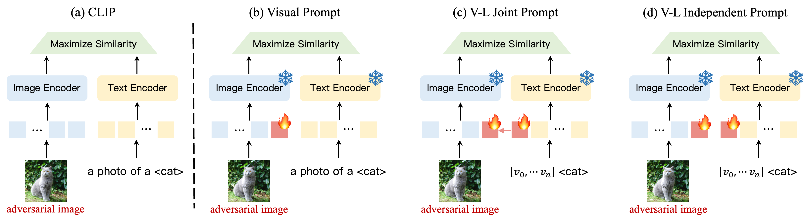

# Multimodal Adversarial Prompt Tuning

This repository implements Multimodal Adversarial Prompt Tuning, a technique for improving the adversarial robustness of pre-trained Vision-Language models.

<p align="center">

</p>

# Environment Setup

To set up the required environment, please follow the installation instructions provided in the [CoOp repository](https://github.com/KaiyangZhou/CoOp#how-to-install).

# Data Preparation

Before training or evaluating the models, you'll need to prepare the necessary datasets. Detailed instructions on downloading, preprocessing, and organizing the data can be found in [DATASETS.md](docs/DATASETS.md).

# Training and Evaluation

This project provides scripts for training and evaluating various prompt designs. You can find all scripts in the `./scripts` directory.


## Example Usage

Here are examples of how to train and evaluate different Multimodal Adversarial Prompt Tuning using a ViT-B/16 backbone in a zero-shot setting:

*   **AdvIVLP (Adversarial V-L Independent Prompt):**

    ```bash
    ./scripts/AdvIVLP/zs_vit16_train_AdvIVLP.sh
    ```

*   **AdvMaple (Adversarial V-L Joint Prompt):**

    ```bash
    ./scripts/AdvMaple/zs_vit16_train_AdvMaple.sh
    ```

*   **AdvVP (Adversarial Visual Prompt):**

    ```bash
    ./scripts/AdvVPT/zs_vit16_train_AdvVPT.sh
    ```

*   **AdvCoOp (Adversarial Textual Prompt):**

    ```bash
    ./scripts/AdvCoOp/zs_vit16_train_AdvCoOp.sh
    ```

# Acknowledgement

This repository is built upon [`MaPLe`](https://github.com/muzairkhattak/multimodal-prompt-learning) and [`CoOp`](https://github.com/KaiyangZhou/CoOp). Thanks for those well-organized codebases.
